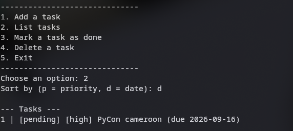

# Task Manager — Dart

Projet final réalisé pour la **certification Next Flutter (FFSC)**.
Une application en ligne de commande, écrite en **Dart pur** (aucune dépendance externe, aucun Flutter), qui permet de gérer une liste de tâches persistée localement dans un fichier JSON.



---

## Fonctionnalités

- Ajouter une tâche (titre, priorité `low` / `medium` / `high`, échéance optionnelle)
- Lister toutes les tâches, triées par **priorité** ou par **date**
- Marquer une tâche comme terminée
- Supprimer une tâche
- Persistance automatique dans un fichier `tasks.json` local

##  Architecture du projet

```
task_manager_cli/
├── bin/
│   └── main.dart                 # Point d'entrée de l'application
├── lib/
│   ├── models/
│   │   ├── task.dart             # Classe abstraite Task (base commune)
│   │   ├── normal_task.dart      # Task -> NormalTask (héritage)
│   │   ├── urgent_task.dart      # Task -> UrgentTask (héritage)
│   │   ├── priority.dart         # enum Priority + extension utilitaire
│   │   └── json_serializable.dart# Interface implémentée par Task
│   ├── repository/
│   │   ├── repository.dart       # Interface générique Repository<T>
│   │   └── task_repository.dart  # Implémentation JSON: Repository<Task>
│   ├── exceptions/
│   │   └── task_exceptions.dart  # Exceptions personnalisées
│   └── cli/
│       └── cli_app.dart          # Boucle de menu / interaction utilisateur
├── test/
│   └── task_repository_test.dart # Tests unitaires (package test)
├── docs/
│   └── demo_screenshot.png
├── pubspec.yaml
└── README.md
```

### Choix techniques (en lien avec le cahier des charges)

| Exigence | Où / comment |
|---|---|
| Classes abstraites + héritage | `Task` (abstraite) → `NormalTask`, `UrgentTask` |
| Interface | `JsonSerializable` et `Comparable<Task>`, implémentées par `Task` |
| Generics | `Repository<T>` (interface), implémentée par `TaskRepository implements Repository<Task>` |
| Exceptions personnalisées | `AppException` → `TaskNotFoundException`, `InvalidTaskException`, `StorageException` |
| Persistance JSON | `TaskRepository` lit/écrit `tasks.json` avec `dart:convert` + `dart:io` |
| Tests unitaires (≥ 5) | `test/task_repository_test.dart` (11 tests) |

`UrgentTask` est toujours en priorité `high` et possède un champ additionnel
(`escalateAfterHours`), ce qui illustre un vrai cas d'héritage avec
comportement spécialisé (`describe()` est redéfini différemment dans chaque
sous-classe → polymorphisme visible directement dans l'affichage CLI).

## Prérequis

- [Dart SDK](https://dart.dev/get-dart) ≥ 3.0.0 installé et accessible dans le `PATH`

Vérifier l'installation :
```bash
dart --version
```

# 1. Cloner le repo
git clone https://github.com/esthera-tiago/Task-Manager.git
cd Task-Manager

# 2. Récupérer les dépendances (juste le package "test" pour les tests)
dart pub get

# 3. Lancer l'application
dart run bin/main.dart
```

Un fichier `tasks.json` sera créé automatiquement à la racine au premier
lancement pour stocker vos tâches.

### Exemple d'utilisation

```
=== Task Manager CLI ===
------------------------------
1. Add a task
2. List tasks
3. Mark a task as done
4. Delete a task
5. Exit
------------------------------
Choose an option: 1
Title: Réviser Dart avancé
Priority (l = low, m = medium, h = high): h
Is this task urgent? (y/n): n
Deadline (YYYY-MM-DD, press Enter to skip): 2026-08-05
Task added.

Choose an option: 2
Sort by (p = priority, d = date): p

--- Tasks ---
1 | [pending] [high] Réviser Dart avancé (due 2026-08-05)

Choose an option: 5
Bye.
```

## Lancer les tests

```bash
dart test
```

Les tests couvrent notamment :
- l'ajout et la lecture d'une tâche,
- le rejet d'un titre vide ou d'un identifiant dupliqué (`InvalidTaskException`),
- la mise à jour et la suppression d'une tâche existante / inexistante (`TaskNotFoundException`),
- le marquage d'une tâche comme terminée,
- le tri par priorité (une `UrgentTask` remonte toujours en premier) et par date,
- la persistance des données après un "redémarrage" du repository (relecture du fichier JSON).

## Limites connues / pistes d'amélioration

- Les identifiants de tâches sont séquentiels (`1`, `2`, `3`...) : simples et
  lisibles, mais non réutilisables après suppression dans cette version.
- Pas de gestion de la concurrence (deux instances de l'app lancées en même
  temps pourraient écraser le fichier JSON de l'une par l'autre).
- Pourrait facilement être étendu avec des catégories/tags, une recherche par
  mot-clé, ou une interface `Flutter` réutilisant directement `lib/models` et
  `lib/repository` tels quels
